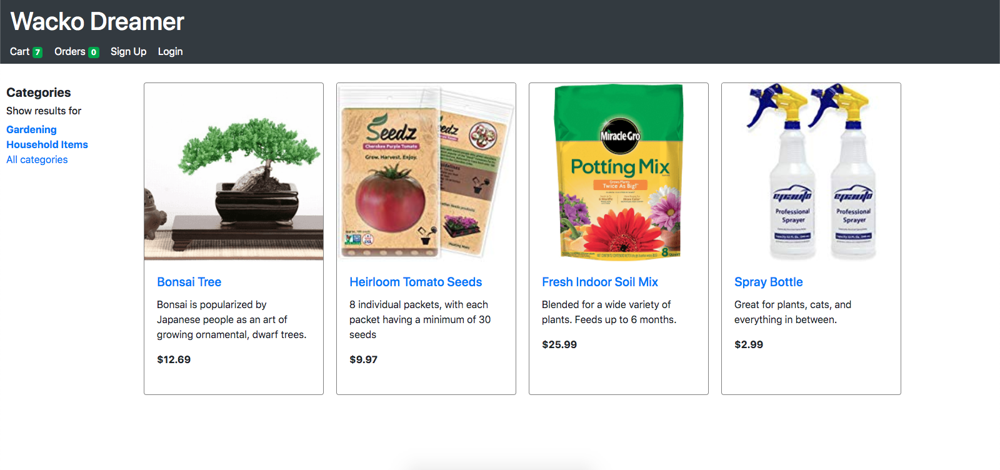
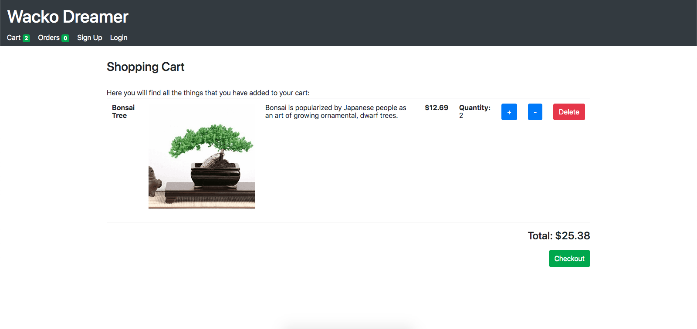

[](https://david-dm.org/briantam23/grace-shopper)
[](https://david-dm.org/briantam23/grace-shopper?type=dev)

# 🛒 Building an e-Commerce app

A Single Page App created with React, Redux, JWT Authentication, and the Stripe API.





## Table of contents
* [What is Stripe?](#what-is-stripe?)
* [Login Credentials](#login-credentials)
* [Live Demo](#live-demo)
* [Dependencies](#dependencies)
* [Requirements](#requirements)
* [Installation](#installation)
* [Running Locally](#running-locally)
* [Deploying to Heroku](#deploying-to-heroku)
* [Contributors](#contributors)

## What is Stripe?
[Stripe](https://stripe.com/) is a service that allows users to accept payments online, specifically developers. With the Stripe application, users can keep track of payments, search past payments, create recurring charges, and keep track of customers.

## Login Credentials

* Username: `sampleAuthUser@gmail.com`  | Password: `a`
* Username: `sampleAdmin@gmail.com`  | Password: `abc123`

## Live Demo

Currently deployed to [Heroku](https://grace-shopper-wd.herokuapp.com)!

## Dependencies

* [React](https://reactjs.org)
* [Redux](https://redux.js.org)
* [PostgreSQL](https://www.postgresql.org)
* [Express](https://expressjs.com)

## Requirements

* [Node.js (v10.16.0)](https://nodejs.org/en/)
* [Git](https://git-scm.com/downloads)
* [PostgreSQL](https://www.postgresql.org/download/)

## Installation

Step 1: Clone Repo
```sh
git clone https://github.com/briantam23/grace-shopper.git` # or clone your own fork
```

Step 2: Create Database
```sh
createdb grace-shopper
```

Step 3: Install `node_modules`
```sh
npm install # or yarn install
```

## Running Locally

```sh
npm run start:dev
```

The `npm run start:dev` command will run 2 processes:
* the `webpack` process (in watch mode) to build your client-side Javascript files
* the Node process for your server with `nodemon`

Your app should now be running on [localhost:3000](http://localhost:3000).

## Deploying to Heroku

Make sure you have the [Heroku CLI](https://devcenter.heroku.com/articles/heroku-cli) installed.

```
heroku create
git push heroku master
heroku open
```

Alternatively, you can deploy your own copy of the app using the web-based flow:

[](https://heroku.com/deploy)

## Contributors

> [Brian Tam](https://github.com/briantam23) <br/>
> [Kylie Gao](https://github.com/kyliegao) <br/>
> [Amr Thameen](https://github.com/amr-thameen) <br/>
> [Francisco Munoz](https://github.com/Francisc089)